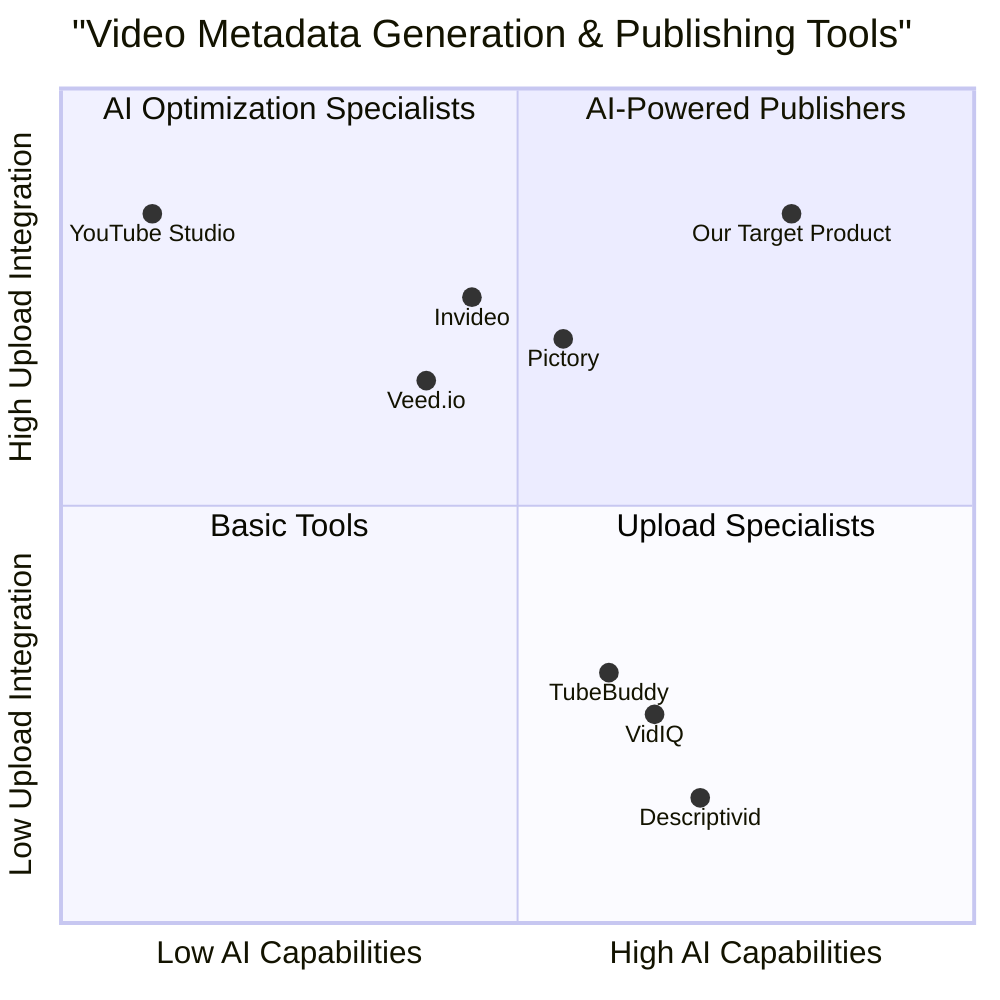
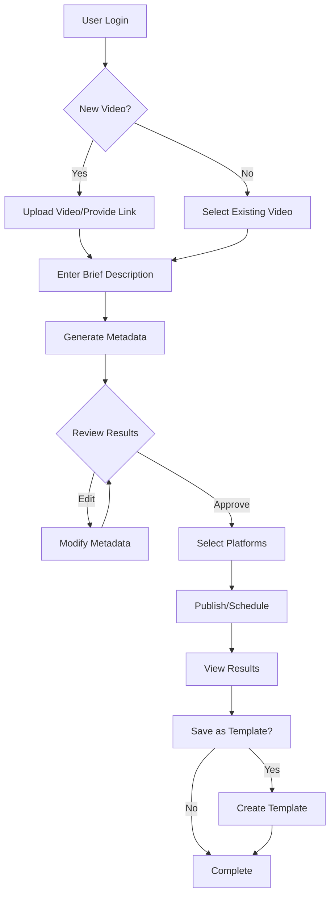
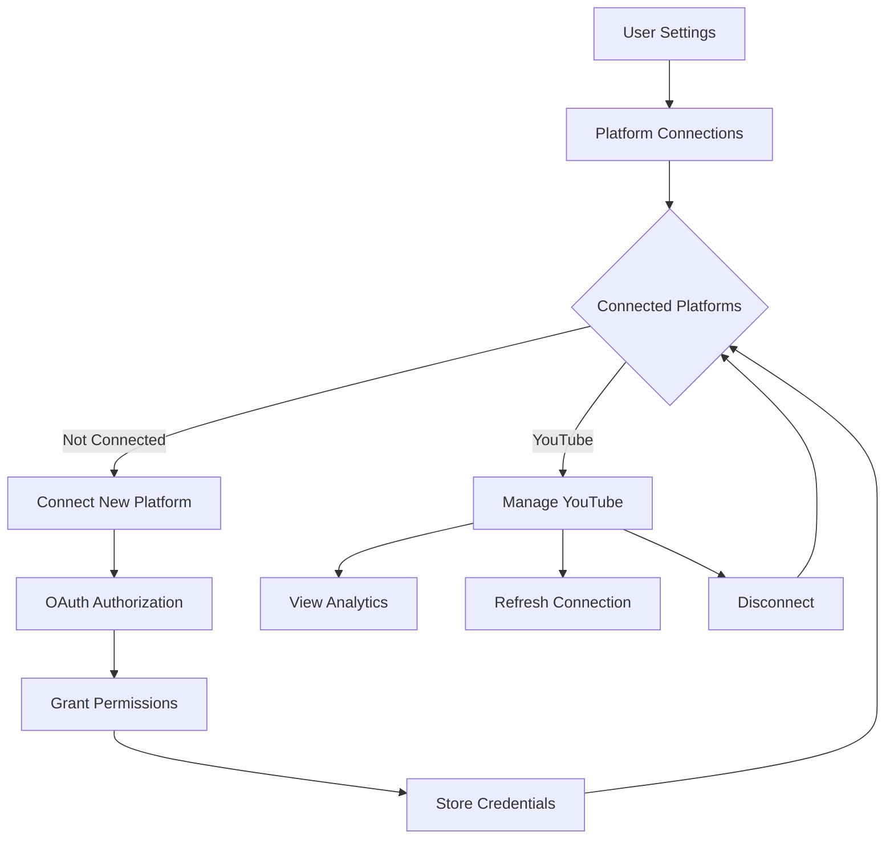

# MetaGenius - AI Metadata Generator

MetaGenius is a web application that helps users automatically generate and manage metadata for their content using AI. This project consists of a React frontend and a Django backend.

## Features

- User authentication (email/password and Google OAuth)
- Metadata generation for various content types
- Dashboard for managing and viewing metadata
- Admin panel for user management
- Light/dark mode support
- Modern and responsive UI

## Prerequisites

- Node.js (v16+) for the frontend
- Python (v3.8+) for the backend
- npm or pnpm for frontend package management
- pip for backend package management
- A Google Cloud Platform account (for Google OAuth integration)

## Environment Setup

### Frontend (.env)

Create a `.env` file in the root of the frontend project:
# Project Summary
MetaGenius is a web application designed to streamline the management and generation of metadata for various digital assets. It focuses on enhancing user experience through intuitive interfaces and efficient functionality, catering to businesses that require robust metadata handling.

# Project Module Description
The MetaGenius application consists of several functional modules:
- **Authentication**: Handles user login and registration through the `LoginForm` and `RegisterForm` components.
- **Metadata Management**: Allows users to create and preview metadata using `MetadataForm` and `PreviewPanel`.
- **File Upload**: Facilitates file uploads via the `UploadModule`.
- **Dashboard**: Provides an overview and access to various application features through the `Dashboard` page.
- **Common Components**: Includes reusable UI elements such as buttons, modals, notifications, and loading spinners.

# Directory Tree
```
react_template/
├── README.md                   # Overview and setup instructions for the React application
├── eslint.config.js            # ESLint configuration for code linting
├── index.html                  # Main HTML file for the application
├── package.json                # Project dependencies and scripts
├── postcss.config.js           # PostCSS configuration for CSS processing
├── public/
│   └── data/
│       └── example.json        # Sample data for testing
├── src/
│   ├── App.jsx                 # Main application component
│   ├── components/             # Contains all UI components
│   │   ├── auth/               # Authentication related components
│   │   ├── common/             # Common reusable components
│   │   ├── layout/             # Layout components like Footer and Navbar
│   │   └── metadata/           # Components for metadata handling
│   ├── contexts/               # Context providers for state management
│   ├── pages/                  # Main pages of the application
│   ├── services/               # API service modules
│   ├── utils/                  # Utility functions
│   ├── index.css               # Global CSS styles
│   └── main.jsx                # Entry point of the application
├── tailwind.config.js          # Tailwind CSS configuration
├── template_config.json        # Configuration for templates
└── vite.config.js              # Vite configuration for building the application
```

# File Description Inventory
- **ai_metadata_generator_prd.md**: Product Requirements Document for the AI metadata generator.
- **meta_genius_class_diagram.mermaid**: Class diagram for the system architecture.
- **meta_genius_sequence_diagram.mermaid**: Sequence diagram illustrating application interactions.
- **meta_genius_system_design.md**: Detailed system architecture design document.
- **react_template/**: Main directory containing the React web application files.

# Technology Stack
- **React**: Front-end library for building user interfaces.
- **Vite**: Build tool for faster development and production builds.
- **Tailwind CSS**: Utility-first CSS framework for styling.
- **ESLint**: Tool for identifying and fixing problems in JavaScript code.
- **PostCSS**: Tool for transforming CSS with JavaScript plugins.

# Usage
To get started with the MetaGenius application:
1. Install dependencies: `npm install`
2. Build the application: `npm run build`
3. Run the application: `npm run start`

# Product Requirements Document: MetaGenius - AI-Powered Video Metadata Generator

## Project Overview

Project Name: meta_genius

Original Requirements: Create a web application that leverages AI to help users generate high-quality metadata for their videos (e.g., descriptions, tags, titles, and thumbnails) before publishing them on platforms like YouTube. The app should allow users to input a brief description of their video, and the AI will generate the remaining metadata. Additionally, users should be able to upload their videos directly to YouTube (or other social media platforms) with a single click.

## 1. Product Definition

### 1.1 Product Goals

1. **Streamline Content Creation Workflow**: Reduce the time creators spend on metadata generation by at least 70% through AI assistance, allowing them to focus on content creation.

2. **Increase Content Discoverability**: Help creators optimize their video metadata for better discovery and engagement on video platforms, leading to higher view counts and subscriber growth.

3. **Simplify Cross-Platform Publishing**: Eliminate friction in the video publishing process by enabling one-click uploads to multiple social media platforms from a single interface.

### 1.2 User Stories

1. **As a content creator**, I want to automatically generate SEO-optimized titles, descriptions, and tags for my videos based on a brief content description, so that I can save time and increase my videos' discoverability.

2. **As a YouTube educator**, I want the system to suggest timestamps for my tutorials based on video content analysis, so that viewers can easily navigate to specific sections of my videos.

3. **As a social media manager**, I want to upload videos to multiple platforms with customized metadata for each platform from a single interface, so that I can efficiently manage multi-platform content distribution.

4. **As a non-technical creator**, I want AI-generated thumbnail suggestions based on my video content, so that I can create eye-catching thumbnails without graphic design skills.

5. **As a channel owner**, I want to save and reuse successful metadata templates, so that I can maintain consistent branding across my video content.

### 1.3 Competitive Analysis

| Competitor | Pros | Cons |
|------------|------|------|
| **VidIQ** | - Excellent keyword research <br> - Channel analytics <br> - Title recommendations <br> - SEO scoring system | - No direct video upload <br> - Limited AI-generation capabilities <br> - Costly premium features <br> - No thumbnail generation |
| **TubeBuddy** | - Tag explorer <br> - A/B testing for thumbnails <br> - SEO tools <br> - Browser extension | - No direct upload functionality <br> - Limited AI text generation <br> - Separate workflow from creation tools |
| **Descriptivid** | - Specialized metadata generation <br> - Good title optimization <br> - Simple interface | - No upload capabilities <br> - Limited platform integrations <br> - Basic analytics only |
| **Invideo** | - Direct YouTube uploads <br> - Video editing features <br> - Mobile apps available | - Focus on video creation (not metadata) <br> - Limited metadata optimization |
| **Pictory** | - Script-to-video conversion <br> - YouTube integration <br> - Blog-to-video capabilities | - Expensive subscription <br> - Limited metadata generation |
| **Veed.io** | - User-friendly interface <br> - Direct YouTube publishing <br> - Caption generation | - Focus on editing, not metadata <br> - Limited AI optimization features |
| **YouTube Studio** | - Native platform integration <br> - Basic analytics <br> - Free to use | - No AI generation <br> - Limited optimization suggestions <br> - Manual metadata entry |

### 1.4 Competitive Quadrant Chart



## 2. Technical Specifications

### 2.1 Requirements Analysis

Based on the competitive analysis and user stories, our MetaGenius application requires:

1. **AI Integration Capabilities**:
   - OpenAI API integration for text-based metadata generation
   - Possible custom AI models for thumbnail suggestions
   - Algorithm for analyzing video content and suggesting timestamps

2. **Platform Integration Requirements**:
   - YouTube Data API v3 for direct video uploads and metadata publishing
   - Authentication handling for multiple platform connections
   - Safe storage of API credentials

3. **User Data Management**:
   - User authentication and profile management
   - Secure storage of user preferences and past metadata
   - Analytics on metadata performance (views, engagement)

4. **UI/UX Requirements**:
   - Clean, intuitive interface for both desktop and mobile users
   - Preview capabilities for all generated metadata
   - Editing interface for fine-tuning AI suggestions
   - Dark/light mode toggle

### 2.2 Requirements Pool

#### P0 (Must Have)

1. **AI Metadata Generation**
   - System must generate SEO-optimized titles, descriptions, and tags based on user input
   - Generated metadata must be editable by users
   - System must provide at least 3 title variations for user selection

2. **YouTube Integration**
   - Users must be able to authenticate with their YouTube account
   - System must support direct video upload to YouTube with generated metadata
   - System must comply with YouTube API quotas and limitations

3. **User Management**
   - Users must be able to create accounts and securely log in
   - System must securely store user credentials and platform connections
   - Users must be able to view their upload history and past metadata

4. **Core UI Features**
   - Responsive interface must work on desktop and mobile devices
   - Input form must allow users to input video details and upload files
   - Preview panel must show all generated metadata before publishing

#### P1 (Should Have)

5. **Thumbnail Generation**
   - System should suggest thumbnail designs based on video content or title
   - Users should be able to customize suggested thumbnails
   - System should provide multiple thumbnail options

6. **Advanced Metadata Features**
   - System should suggest timestamps for longer videos
   - System should provide keyword density analysis
   - System should analyze trending topics related to video content

7. **Metadata Templates**
   - Users should be able to save successful metadata formats as templates
   - System should allow for quick application of templates to new videos
   - System should support channel-specific templates

8. **Platform Expansion**
   - System should support additional platforms beyond YouTube (e.g., TikTok, Instagram)
   - Metadata should be adaptable to platform-specific requirements

#### P2 (Nice to Have)

9. **Analytics Integration**
   - System may integrate with YouTube Analytics to show performance of published videos
   - System may provide optimization suggestions based on performance data
   - System may compare metadata performance across different videos

10. **AI Training from User Feedback**
    - System may learn from user edits to improve future suggestions
    - System may adapt to specific creator's style over time
    - System may suggest improvements based on industry trends

11. **Collaboration Features**
    - System may allow teams to collaborate on video metadata
    - System may support role-based permissions for larger channels
    - System may enable approval workflows for publishing

12. **Advanced UI Features**
    - System may include a dark/light mode toggle
    - System may support keyboard shortcuts for power users
    - System may provide accessibility features for users with disabilities

### 2.3 UI Design Draft

The interface will be organized into four main components:

1. **Input Panel (Left)**
   - Video upload/link area
   - Brief description input field
   - Content category selection
   - Target audience definition
   - Generate button

2. **Metadata Preview (Center)**
   - Title preview with variations
   - Description with formatting preview
   - Tags display with relevance indicators
   - Thumbnail preview gallery

3. **Editing Tools (Right)**
   - Edit fields for each metadata component
   - SEO score indicators
   - Keyword suggestions
   - Format helpers

4. **Publishing Panel (Bottom)**
   - Platform selection toggles
   - Account connection indicators
   - Scheduling options
   - Publish button

Key interactions:
- Drag-and-drop video upload
- One-click metadata generation
- Real-time editing with preview updates
- Platform-specific validation indicators

### 2.4 Open Questions

1. **AI Model Selection**: Which specific OpenAI model offers the best balance between cost and quality for metadata generation?

2. **Thumbnail Generation Approach**: Should we use a third-party AI service for thumbnail generation or develop our own custom model?

3. **Video Processing**: Do we need to process/analyze video content directly, or can we rely on user descriptions?

4. **Pricing Model**: What pricing structure balances accessibility for creators while covering API costs (freemium, subscription, usage-based)?

5. **Platform Prioritization**: Beyond YouTube, which platforms should be prioritized for the initial release?

## 3. Technical Architecture

### 3.1 Frontend Architecture

- **Framework**: React with Vite for fast development
- **State Management**: Context API for simpler state needs; Redux if complexity increases
- **Styling**: Tailwind CSS for utility-first styling approach
- **Key Components**:
  - `VideoUploader`: Handles file uploads and progress tracking
  - `MetadataForm`: Manages user input for AI generation
  - `MetadataPreview`: Displays AI-generated content with edit capabilities
  - `PlatformConnector`: Manages social media authentication and uploads
  - `UserDashboard`: Shows history and saved templates

### 3.2 Backend Architecture

- **Framework**: Django (Python)
- **Database**: PostgreSQL for structured data storage
- **Authentication**: Djoser + JWT for secure user management
- **Caching**: Redis for performance optimization
- **Key Services**:
  - `AIService`: Interface with OpenAI API
  - `YouTubeService`: Handle YouTube API interactions
  - `MetadataService`: Process and optimize metadata
  - `UserService`: Manage user data and preferences
  - `AnalyticsService`: Track metadata performance

### 3.3 API Structure

- `/api/auth/` - Authentication endpoints
- `/api/videos/` - Video upload and management
- `/api/metadata/` - Metadata generation and retrieval
- `/api/platforms/` - Social media platform connections
- `/api/templates/` - Saved metadata templates

### 3.4 Data Models

```python
# Core models (simplified)

class User(AbstractUser):
    profile_image = models.ImageField(upload_to='profiles/', null=True, blank=True)
    preferences = JSONField(default=dict)
    subscription_tier = models.CharField(max_length=50, default='free')

class PlatformConnection(models.Model):
    user = models.ForeignKey(User, on_delete=models.CASCADE)
    platform_name = models.CharField(max_length=100)
    access_token = models.TextField()
    refresh_token = models.TextField(null=True, blank=True)
    expires_at = models.DateTimeField()
    connected_at = models.DateTimeField(auto_now_add=True)

class Video(models.Model):
    user = models.ForeignKey(User, on_delete=models.CASCADE)
    title = models.CharField(max_length=255)
    description = models.TextField()
    file_path = models.CharField(max_length=500, null=True, blank=True)
    video_url = models.URLField(null=True, blank=True)
    duration = models.IntegerField(null=True, blank=True)
    created_at = models.DateTimeField(auto_now_add=True)
    updated_at = models.DateTimeField(auto_now=True)

class Metadata(models.Model):
    video = models.ForeignKey(Video, on_delete=models.CASCADE)
    title_options = JSONField(default=list)  # Store multiple title options
    selected_title = models.CharField(max_length=255, null=True, blank=True)
    description = models.TextField()
    tags = JSONField(default=list)
    thumbnail_options = JSONField(default=list)  # URLs to thumbnail options
    selected_thumbnail = models.CharField(max_length=500, null=True, blank=True)
    timestamps = JSONField(default=list)  # Suggested timestamps
    is_published = models.BooleanField(default=False)
    platform_data = JSONField(default=dict)  # Store platform-specific metadata

class MetadataTemplate(models.Model):
    user = models.ForeignKey(User, on_delete=models.CASCADE)
    name = models.CharField(max_length=100)
    description = models.TextField(null=True, blank=True)
    structure = JSONField()  # Template structure
    created_at = models.DateTimeField(auto_now_add=True)
    updated_at = models.DateTimeField(auto_now=True)
```

## 4. User Flow Diagrams

### 4.1 Core User Flow



### 4.2 Account Connection Flow



## 5. Implementation Guidelines

### 5.1 Development Phases

#### Phase 1: Core Functionality (6-8 weeks)
- User authentication system
- Basic AI metadata generation (titles, descriptions, tags)
- YouTube API integration
- Simple dashboard UI

#### Phase 2: Enhanced Features (4-6 weeks)
- Thumbnail suggestions
- Metadata templates
- Advanced editing tools
- Analytics dashboard

#### Phase 3: Platform Expansion (4-6 weeks)
- Additional platform integrations
- Advanced AI features
- Collaboration tools
- Performance optimizations

### 5.2 Testing Strategy

- **Unit Tests**: Test individual components and services
- **Integration Tests**: Verify AI and platform integrations
- **User Testing**: Conduct beta testing with content creators
- **Performance Testing**: Ensure system handles concurrent users
- **Security Testing**: Validate protection of user data and API keys

### 5.3 Performance Considerations

- Implement request caching for AI services to reduce API costs
- Use background workers for video processing tasks
- Optimize database queries for user dashboard performance
- Implement CDN for thumbnail and static asset delivery
- Utilize Redis for session management and frequent data access

## 6. Success Metrics

### 6.1 Key Performance Indicators

- **User Adoption**: Number of active users, growth rate
- **Engagement**: Average time saved per video, features used per session
- **Effectiveness**: Improvement in video performance metrics for users
- **Retention**: Monthly active users, subscription renewal rate
- **Technical**: API response times, error rates, system uptime

### 6.2 Monitoring Plan

- Implement application monitoring with Sentry or similar tools
- Track API usage and costs for OpenAI and platform APIs
- Collect user feedback through in-app surveys
- Monitor video performance data (where available through APIs)
- Set up alerting for critical system failures

## 7. Future Enhancements

### 7.1 Potential Extensions

- **AI Video Summary**: Generate video summaries for descriptions
- **Language Localization**: Support metadata generation in multiple languages
- **Content Calendar**: Integrated planning tools for video releases
- **Community Features**: Share templates with other creators
- **Advanced Analytics**: Competitive analysis and trend prediction

### 7.2 Research Areas

- Exploring custom AI models for platform-specific optimization
- Video content analysis for automated tagging
- Thumbnail effectiveness prediction algorithms
- Trend forecasting for content planning

## 8. Risks and Mitigation

### 8.1 Identified Risks

| Risk | Impact | Probability | Mitigation |
|------|--------|------------|------------|
| OpenAI API costs exceed budget | High | Medium | Implement caching, rate limiting, and usage tiers |
| YouTube API policy changes | High | Low | Monitor policy updates, design for adaptability |
| Poor AI-generated content quality | Medium | Medium | Implement quality checks, user feedback mechanisms |
| Security breach of platform credentials | High | Low | Use OAuth, secure storage, regular audits |
| Low user adoption | High | Medium | Focus on UX, creator testimonials, free tier |

### 8.2 Contingency Plans

- Establish multiple AI provider options to prevent vendor lock-in
- Create fallback functionality for direct platform uploads
- Develop offline batch processing mode for high-load scenarios
- Plan for graduated feature rollout based on usage patterns

## 9. Conclusion

The MetaGenius AI-Powered Video Metadata Generator addresses a critical pain point for content creators by automating the time-consuming process of metadata creation while optimizing for discoverability. By combining AI generation capabilities with direct platform integration, this product offers a streamlined workflow that differentiates it from existing solutions in the market.

The implementation approach prioritizes core functionality for YouTube integration first, with a plan to expand to additional platforms based on user demand. The technical architecture leverages modern frameworks and services that align with the specified requirements while providing a foundation for future scaling.

Success will be measured by user adoption, time savings, and improvement in video performance metrics, with a continuous feedback loop to refine AI capabilities over time.
